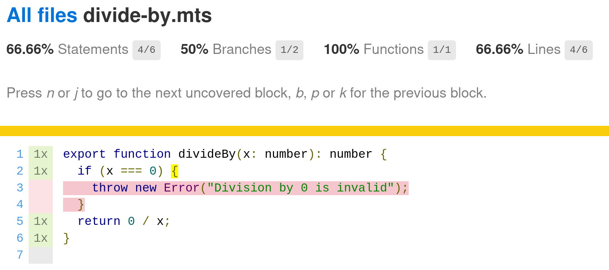
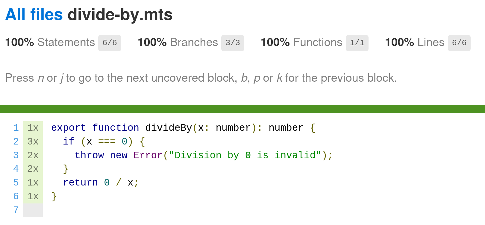

# I have 100% Coverage

How could I have a regression?

<!--
We all love tests.
We swear by them
We shun untested projects
But are our tests any good?
-->

---
transition: fade-out
---

# $ whoami

Slidev is a slides maker and presenter designed for developers, consist of the following features

- 📝 **Text-based** - focus on the content with Markdown, and then style them later
- 🎨 **Themable** - theme can be shared and used with npm packages
- 🧑‍💻 **Developer Friendly** - code highlighting, live coding with autocompletion
- 🤹 **Interactive** - embedding Vue components to enhance your expressions
- 🎥 **Recording** - built-in recording and camera view
- 📤 **Portable** - export into PDF, PNGs, or even a hostable SPA
- 🛠 **Hackable** - anything possible on a webpage

<br>
<br>

Read more about [Why Slidev?](https://sli.dev/guide/why)

<!--
You can have `style` tag in markdown to override the style for the current page.
Learn more: https://sli.dev/guide/syntax#embedded-styles
-->

<style>
h1 {
  background-color: #2B90B6;
  background-image: linear-gradient(45deg, #4EC5D4 10%, #146b8c 20%);
  background-size: 100%;
  -webkit-background-clip: text;
  -moz-background-clip: text;
  -webkit-text-fill-color: transparent;
  -moz-text-fill-color: transparent;
}
</style>

<!--
Here is another comment.
-->

---
layout: default
---

# Tests Quality

Who has:
<v-clicks>

- Tests for their code?
- Seen these tests fail?
- High Code Coverage?
- Confidence in their tests?

</v-clicks>

---
layout: default
---

# Table of contents

<Toc maxDepth="1"></Toc>

---
layout: default
---

# Coverage

## Coverage is Great!

<v-clicks>

- Shows which lines/branches of code are covered by tests
- Which lines aren't
    - Quite Useful for Quirky Exception Testing

</v-clicks>

---
layout: center
level: 2
---
### Code
```ts
export function divideBy(a: number, b: number): number {
  if (b === 0) {
    throw new Error("Division by 0 is Invalid!");
  }
  return a / b;
}
```

### Tests
```ts
import "mocha";
import { expect } from "chai";
import { divideBy } from "../src/divide-by.mjs";

describe("Error Handling Tests", () => {
  it("Existence Check", () => expect(divideBy).to.exist);
  it("Doesn't Throw on Non-0 Argument", () => expect(divideBy(1,1)).to.not.throw);
  it("Naive Notation", () => expect(() => divideBy(0,0)).to.throw);
});
```

---
layout: center
level: 2
---

> $ npx tsc && npx c8 mocha  
>  
>  
>  Error Handling Tests  
>    ✔ Existence Check  
>    ✔ Doesn't Throw on Non-0 Argument  
>    ✔ Naive Notation  
>  
>  
>  3 passing (3ms)

Yay, Right?
---
layout: center
level: 2
---



---
layout: center
level: 2
---

```ts {1,2|1-4|5,6|3-6}{lines: true}
it("Naive Notation", () =>
  expect(() => divideBy(0)).to.throw);
it("Correct Notation", () =>
  expect(() => divideBy(0)).to.throw());
it("Explicit Notation", () =>
  expect(() => divideBy(0)).to.throw("Division by 0 is invalid"));
```

---
layout: center
level: 2
---



---
layout: fact
level: 2
---

Tests validate your code works as expected

Coverage validates you're invoking your code

---
layout: section
---

# Mutation Testing

We still haven't assesed how good our tests are

---
level: 2
---

# Installing Stryker

```sh
npm i -D stryker-cli
npx stryker init
```
---
level: 2
---

# Running Stryker

```sh
npx stryker run
```
---
layout: center
level: 2
---

# Edge Cases on * <=> / mutation

0 and 1 have special identity behaviours.

$$
\begin{array}{cc}
  0\times1 = 0\div1 & 1\times1 = 1\div1 \\
  0\times2 = 0\div2 & 2\times1 = 2\div1 \\
  0\times3 = 0\div3 & 3\times1 = 3\div1 \\
\end{array}
$$

**You probably don't want to test using these values**

---
hideInToc: true
---
# Final Tests

```ts
import "mocha";
import { expect } from "chai";
import { divideBy } from "../src/divide-by.mjs";

describe("Error Handling Tests", () => {
  it("Doesn't Throw on Non-0 Argument", () =>
    expect(divideBy(1, 1)).to.not.throw);
  it("Explicit Notation", () =>
    expect(() => divideBy(1, 0)).to.throw("Division by 0 is Invalid!"));
  it("Result Expression", () => expect(divideBy(4,2)).equals(2));
});

```